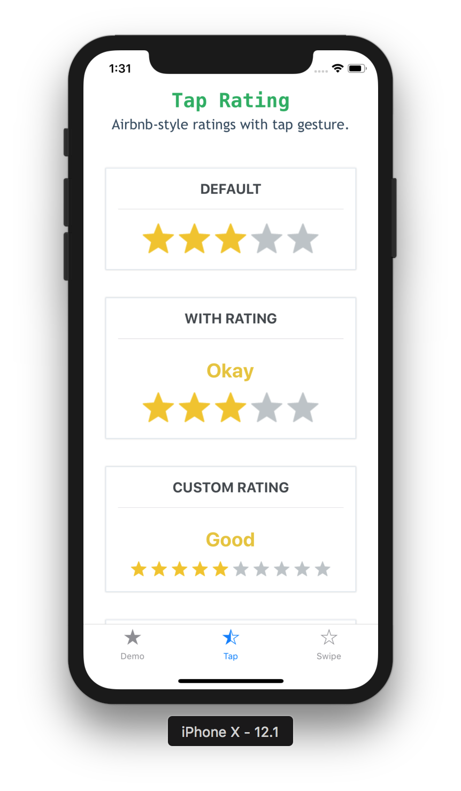
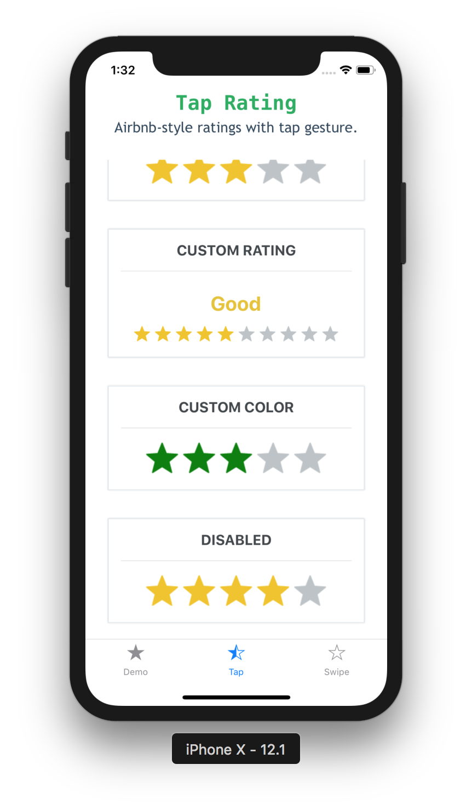
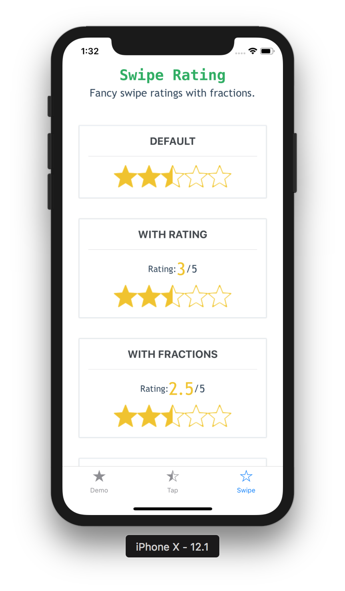
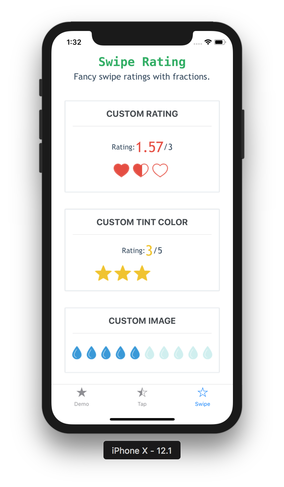

<p align="center">
  <a href="https://github.com/Monte9/react-native-ratings">
    
  </a>
</p>

<p align="center">
  Ratings component for React Native with tap and swipe enabled.
</p>

<p align="center">
  <a href="https://www.npmjs.com/package/react-native-ratings"></a>
  <a href="https://www.npmjs.com/package/react-native-ratings"></a>
</p>

## Demo - [try it now](https://expo.io/@monte9/react-native-ratings)


### Tap Rating

<div style="flex-direction: row">
  
  
</div>

### Swipe Rating

<div style="flex-direction: row">
  
  
</div>

## Installation

Install the package using yarn or npm:

```yarn add react-native-ratings```

  OR
  
```npm install --save react-native-ratings```

## Usage

``` js
import { Rating, AirbnbRating } from 'react-native-ratings';

const WATER_IMAGE = require('./water.png')

ratingCompleted(rating) {
  console.log("Rating is: " + rating)
}

<AirbnbRating />

<AirbnbRating
  count={11}
  reviews={["Terrible", "Bad", "Meh", "OK", "Good", "Hmm...", "Very Good", "Wow", "Amazing", "Unbelievable", "Jesus"]}
  defaultRating={11}
  size={20}
/>

<Rating
  showRating
  onFinishRating={this.ratingCompleted}
  style={{ paddingVertical: 10 }}
/>

<Rating
  type='heart'
  ratingCount={3}
  imageSize={60}
  showRating
  onFinishRating={this.ratingCompleted}
/>

<Rating
  type='custom'
  ratingImage={WATER_IMAGE}
  ratingColor='#3498db'
  ratingBackgroundColor='#c8c7c8'
  ratingCount={10}
  imageSize={30}
  onFinishRating={this.ratingCompleted}
  style={{ paddingVertical: 10 }}
/>
```

Also refer to the [`example`](https://github.com/Monte9/react-native-ratings/tree/master/react_native_ratings_example) app for more detailed usage example.

## API

### AirbnbRating

| prop | default | type | description |
| ---- | ---- | ----| ---- |
| defaultRating | 3 | number | Initial value for the rating |
| reviews | ['Terrible', 'Bad', 'Okay', 'Good', 'Great'] | string[] | Labels to show when each value is tapped e.g. If the first star is tapped, then value in index 0 will be used as the label |
| count | 5 | number | Total number of ratings to display |
| selectedColor | #f1c40f | string (color) | Pass in a custom fill-color for the rating icon |
| unSelectedColor | #BDC3C7 | string (color) | Pass in a custom not fill-color for the rating icon |
| reviewColor | #f1c40f | string (color) | Pass in a custom text color for the review text |
| size | 40 | number | The size of each rating image (optional) |
| reviewSize | 25 | number | Pass in a custom font size for the review text |
| showRating | `true` | boolean | Determines if to show the reviews above the rating |
| isDisabled | false | boolean | Whether the rating can be modiefied by the user |
| onFinishRating | none | function(value: number) | Callback method when the user finishes rating. Gives you the final rating value as a whole number |
| starContainerStyle | none | object or stylesheet | Custom styles applied to the star container |
| ratingContainerStyle | none | object or stylesheet | Custom styles applied to the rating container |
| starImage | STAR_IMAGE | string | Pass in a custom base image source (optional) |

### RatingProps

| prop | default | type | description |
| ---- | ---- | ----| ---- |
| type | `star` | string | Choose one of the built-in types: `star`, `rocket`, `bell`, `heart` or use type `custom` to render a custom image (optional) |
| ratingImage | `star` | string | Pass in a custom image source; use this along with `type='custom'` prop above (optional) |
| ratingColor | #f1c40f | string (color) | Pass in a custom fill-color for the rating icon; use this along with `type='custom'` prop above (optional) |
| ratingBackgroundColor | `white` | string (color) | Pass in a custom background-fill-color for the rating icon; use this along with `type='custom'` prop above (optional) |
| tintColor | none | string | Color used to change the background of the rating icon (optional)|
| ratingCount | 5 | number | The number of rating images to display (optional) |
| ratingTextColor | none | string | Color used for the text labels |
| imageSize | 50 | number | The size of each rating image (optional) |
| showRating | none | boolean | Displays the Built-in Rating UI to show the rating value in real-time (optional) |
| readonly | false | boolean | Whether the rating can be modiefied by the user |
| startingValue | `ratingCount/2` | number | The initial rating to render |
| fractions | 2 | number | The number of decimal places for the rating value; must be between 0 and 20 |
| minValue | 0 | number | The minimum value the user can select |
| style | none | style | Exposes style prop to add additonal styling to the container view (optional) |
| jumpValue | 0 | number | The value to jump when rating value changes (if `jumpValue` === 0.5, rating value increases/decreases like 0, 0.5, 1.0, 1.5 ...). Default is 0 (not to jump)|
| onStartRating | none | function(rating: number) | Callback method when the user starts rating. Gives you the start rating value as a whole number |
| onSwipeRating | none | function(rating: number) | Callback method when the user is swiping. Gives you the current rating value as a whole number|
| onFinishRating | none | function(rating: number) | Callback method when the user finishes rating. Gives you the final rating value as a whole number (required) |

## Try it out

You can try it out with Expo [here](https://expo.io/@monte9/react-native-ratings). Or you can also run the [`example`](https://github.com/Monte9/react-native-ratings/tree/master/react_native_ratings_example) app locally.


## Motivation

One of my friends showed me [this](https://github.com/kartik-v/bootstrap-star-rating/) [Star Rating feature in Bootstrap](http://plugins.krajee.com/star-rating-demo-theme-default) and it looks really interesting. So I challenged myself to re-implement it in React Native.

Followed by that, for `v3`, I recreated the Airbnb ratings component and added it to this repo, in case others find this useful. It works out of the box and is quite functional.

Also this is my first [`npm module`](https://www.npmjs.com/package/react-native-ratings) :confetti_ball:

## Feedback

This repo is being actively manitained. Feel free to open a new Issue with a `Feature Request` or submit a PR with an `Enhancement`.
